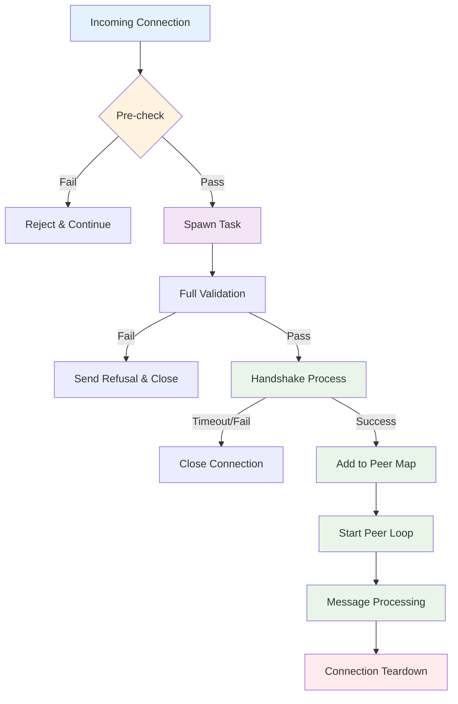

# Neptune Node Connection Flow Analysis & DDoS Vulnerabilities

**Date**: 2025-12-19
**Branch**: `feature/ddos-mitigation`
**Status**: Analysis Complete - Implementation Pending

## Executive Summary

This document provides a comprehensive analysis of the Neptune node's connection handling architecture, identifies critical DDoS vulnerabilities, and outlines the complete connection lifecycle from establishment to teardown.

## Table of Contents

1. [Connection Architecture Overview](#connection-architecture-overview)
2. [Peer-to-Peer Connection Flow](#peer-to-peer-connection-flow)
3. [RPC Connection Flow](#rpc-connection-flow)
4. [Connection Lifecycle Diagram](#connection-lifecycle-diagram)
5. [Critical DDoS Vulnerabilities](#critical-ddos-vulnerabilities)
6. [Code Snippets Analysis](#code-snippets-analysis)
7. [Recommended Mitigation Strategy](#recommended-mitigation-strategy)

## Connection Architecture Overview

The Neptune node handles two types of connections:

1. **Peer-to-Peer Connections** (`neptune-core`) - For blockchain network communication
2. **RPC Connections** (`neptune-core-cli`) - For API access and wallet operations

Both connection types are vulnerable to DDoS attacks due to insufficient rate limiting and resource protection mechanisms.

## Peer-to-Peer Connection Flow

### 1. Connection Acceptance

**Location**: `neptune-core/src/application/loops/main_loop.rs:1698-1723`

```rust
// Handle incoming connections from peer
Ok((stream, peer_address)) = self.incoming_peer_listener.accept() => {
    if !precheck_incoming_connection_is_allowed(self.global_state_lock.cli(), peer_address.ip()) {
        continue;
    }

    let state = self.global_state_lock.lock_guard().await;
    let main_to_peer_broadcast_rx_clone: broadcast::Receiver<MainToPeerTask> = self.main_to_peer_broadcast_tx.subscribe();
    let peer_task_to_main_tx_clone: mpsc::Sender<PeerTaskToMain> = self.peer_task_to_main_tx.clone();
    let own_handshake_data: HandshakeData = state.get_own_handshakedata();
    let global_state_lock = self.global_state_lock.clone(); // bump arc refcount.
    let incoming_peer_task_handle = tokio::task::spawn(async move {
        match answer_peer(
            stream,
            global_state_lock,
            peer_address,
            main_to_peer_broadcast_rx_clone,
            peer_task_to_main_tx_clone,
            own_handshake_data,
        ).await {
            Ok(()) => (),
            Err(err) => debug!("Got result: {:?}", err),
        }
    });
    main_loop_state.task_handles.push(incoming_peer_task_handle);
    main_loop_state.task_handles.retain(|th| !th.is_finished());
}
```

### 2. Pre-check Validation

**Location**: `neptune-core/src/application/loops/connect_to_peers.rs:85-116`

```rust
/// Initial check if incoming connection is allowed. Performed prior to the
/// sending of the handshake.
pub(crate) fn precheck_incoming_connection_is_allowed(
    cli: &cli_args::Args,
    connecting_ip: IpAddr,
) -> bool {
    let connecting_ip = match connecting_ip {
        IpAddr::V4(_) => connecting_ip,
        IpAddr::V6(v6) => match v6.to_ipv4() {
            Some(v4) => std::net::IpAddr::V4(v4),
            None => connecting_ip,
        },
    };
    if cli.restrict_peers_to_list {
        let allowed_ips: Vec<std::net::IpAddr> = cli.peers.iter().map(|p| p.ip()).collect();
        let is_allowed = allowed_ips.contains(&connecting_ip);
        if !is_allowed {
            debug!("Rejecting incoming connection from unlisted peer {connecting_ip} due to --restrict-peers-to-list",);
            return false;
        }
    }

    if cli.ban.contains(&connecting_ip) {
        debug!("Rejecting incoming connection because it's explicitly banned");
        return false;
    }

    if cli.disallow_all_incoming_peer_connections() {
        debug!("Rejecting incoming connection because all incoming connections are disallowed");
        return false;
    }

    true
}
```

### 3. Full Connection Validation

**Location**: `neptune-core/src/application/loops/connect_to_peers.rs:122-215`

```rust
/// Check if connection is allowed. Used for both ingoing and outgoing connections.
///
/// Locking:
///   * acquires `global_state_lock` for read
async fn check_if_connection_is_allowed(
    global_state_lock: GlobalStateLock,
    own_handshake: &HandshakeData,
    other_handshake: &HandshakeData,
    peer_address: &SocketAddr,
) -> InternalConnectionStatus {
    let cli_arguments = global_state_lock.cli();
    let global_state = global_state_lock.lock_guard().await;

    // Disallow connection if peer is banned via CLI arguments
    if cli_arguments.ban.contains(&peer_address.ip()) {
        let ip = peer_address.ip();
        debug!("Peer {ip}, banned via CLI argument, attempted to connect. Disallowing.");
        return InternalConnectionStatus::Refused(ConnectionRefusedReason::BadStanding);
    }

    // Disallow connection if peer is in bad standing
    let standing = global_state
        .net
        .get_peer_standing_from_database(peer_address.ip())
        .await;

    if standing.is_some_and(|s| s.is_bad()) {
        let ip = peer_address.ip();
        debug!("Peer {ip}, banned because of bad standing, attempted to connect. Disallowing.");
        return InternalConnectionStatus::Refused(ConnectionRefusedReason::BadStanding);
    }

    if let Some(time) = global_state
        .net
        .last_disconnection_time_of_peer(other_handshake.instance_id)
    {
        if SystemTime::now()
            .duration_since(time)
            .is_ok_and(|d| d < cli_arguments.reconnect_cooldown)
        {
            debug!(
                "Refusing connection with {peer_address} \
                 due to reconnect cooldown ({cooldown} seconds).",
                cooldown = cli_arguments.reconnect_cooldown.as_secs(),
            );

            // A "wrong" reason is given because of backwards compatibility.
            // todo: Use next breaking release to give a more accurate reason here.
            let reason = ConnectionRefusedReason::MaxPeerNumberExceeded;
            return InternalConnectionStatus::Refused(reason);
        }
    }

    // Disallow connection if max number of peers has been reached or
    // exceeded. There is another test in `answer_peer_inner` that precedes
    // this one; however this test is still necessary to resolve potential
    // race conditions.
    // Note that if we are bootstrapping, then we *do* want to accept the
    // connection and temporarily exceed the maximum. In this case a
    // `DisconnectFromLongestLivedPeer` message should have been sent to
    // the main loop already but that message need not have been processed by
    // the time we get here.
    if cli_arguments.max_num_peers <= global_state.net.peer_map.len() && !cli_arguments.bootstrap {
        return InternalConnectionStatus::Refused(ConnectionRefusedReason::MaxPeerNumberExceeded);
    }

    // Disallow connection to already connected peer.
    if global_state.net.peer_map.values().any(|peer| {
        peer.instance_id() == other_handshake.instance_id
            || *peer_address == peer.connected_address()
    }) {
        return InternalConnectionStatus::Refused(ConnectionRefusedReason::AlreadyConnected);
    }

    // Cap connections per IP, if specified.
    if let Some(max_connections_per_ip) = cli_arguments.max_connections_per_ip {
        let peer_ip = peer_address.ip();
        let num_connections_to_this_ip = global_state
            .net
            .peer_map
            .keys()
            .map(|x| x.ip())
            .filter(|ip| *ip == peer_ip)
            .count();
        if num_connections_to_this_ip >= max_connections_per_ip {
            return InternalConnectionStatus::Refused(
                ConnectionRefusedReason::MaxPeerNumberExceeded,
            );
        }
    }

    // Disallow connection to self
    if own_handshake.instance_id == other_handshake.instance_id {
        return InternalConnectionStatus::Refused(ConnectionRefusedReason::SelfConnect);
    }

    // Disallow connection if versions are incompatible
    if !versions_are_compatible(&own_handshake.version, &other_handshake.version) {
        return InternalConnectionStatus::Refused(ConnectionRefusedReason::IncompatibleVersion);
    }

    InternalConnectionStatus::Accepted
}
```

### 4. Handshake Process

**Location**: `neptune-core/src/application/loops/connect_to_peers.rs:284-377`

```rust
async fn answer_peer_inner<S>(
    stream: S,
    state: GlobalStateLock,
    peer_address: SocketAddr,
    main_to_peer_task_rx: broadcast::Receiver<MainToPeerTask>,
    peer_task_to_main_tx: mpsc::Sender<PeerTaskToMain>,
    own_handshake_data: HandshakeData,
) -> Result<()>
where
    S: AsyncRead + AsyncWrite + Debug + Unpin,
{
    debug!("Established incoming TCP connection with {peer_address}");

    // Build the communication/serialization/frame handler
    let length_delimited = Framed::new(stream, get_codec_rules());
    let mut peer = SymmetricallyFramed::<
        Framed<S, LengthDelimitedCodec>,
        PeerMessage,
        Bincode<PeerMessage, PeerMessage>,
    >::new(length_delimited, SymmetricalBincode::default());

    // Complete Neptune handshake
    let Some(PeerMessage::Handshake {
        magic_value,
        data: peer_handshake_data,
    }) = peer.try_next().await?
    else {
        bail!("Didn't get handshake on connection attempt");
    };
    ensure!(
        magic_value == *MAGIC_STRING_REQUEST,
        "Expected magic value, got {magic_value:?}",
    );

    let handshake_response = PeerMessage::Handshake {
        magic_value: *MAGIC_STRING_RESPONSE,
        data: Box::new(own_handshake_data),
    };
    peer.send(handshake_response).await?;

    // Verify peer network before moving on
    let peer_network = peer_handshake_data.network;
    let own_network = own_handshake_data.network;
    ensure!(
        peer_network == own_network,
        "Cannot connect with {peer_address}: \
        Peer runs {peer_network}, this client runs {own_network}."
    );

    // Check if incoming connection is allowed
    let connection_status = check_if_connection_is_allowed(
        state.clone(),
        &own_handshake_data,
        &peer_handshake_data,
        &peer_address,
    )
    .await;
    peer.send(PeerMessage::ConnectionStatus(connection_status.into()))
        .await?;
    if let InternalConnectionStatus::Refused(reason) = connection_status {
        let reason = format!("Refusing incoming connection. Reason: {reason:?}");
        debug!("{reason}");
        bail!("{reason}");
    }

    // Whether the incoming connection comes from a peer in bad standing is
    // checked in `check_if_connection_is_allowed`. So if we get here, we are
    // good to go.
    info!("Connection accepted from {peer_address}");

    // If necessary, disconnect from another, existing peer.
    if connection_status == InternalConnectionStatus::AcceptedMaxReached && state.cli().bootstrap {
        info!("Maximum # peers reached, so disconnecting from an existing peer.");
        peer_task_to_main_tx
            .send(PeerTaskToMain::DisconnectFromLongestLivedPeer)
            .await?;
    }

    let peer_distance = 1; // All incoming connections have distance 1
    let mut peer_loop_handler = PeerLoopHandler::new(
        peer_task_to_main_tx,
        state,
        peer_address,
        *peer_handshake_data,
        true,
        peer_distance,
    );

    peer_loop_handler
        .run_wrapper(peer, main_to_peer_task_rx)
        .await?;

    Ok(())
}
```

## RPC Connection Flow

### 1. RPC Server Startup

**Location**: `neptune-core-cli/src/rpc/server.rs:14-60`

```rust
/// Start the RPC server
pub async fn start(config: crate::rpc::RpcConfig) -> Result<()> {
    let addr = format!("127.0.0.1:{}", config.port);
    let listener = TcpListener::bind(&addr)
        .await
        .context("Failed to bind RPC server")?;

    info!("Starting neptune-cli RPC server on {}", addr);
    info!("Data directory: {:?}", config.data_dir);

    // Use neptune-core's existing cookie system (same pattern as main.rs)
    // The data_dir in RpcConfig is already the full path from DataDirectory::get().root_dir_path()
    let data_directory = neptune_cash::application::config::data_directory::DataDirectory::get(
        None, // Use default data directory since config.data_dir is already the full path
        neptune_cash::application::config::network::Network::Main,
    )?;

    // Load cookie using exact same pattern as main.rs
    let token: neptune_cash::application::rpc::auth::Token =
        match neptune_cash::application::rpc::auth::Cookie::try_load(&data_directory).await {
            Ok(t) => t.into(),
            Err(e) => {
                error!("Unable to load RPC auth cookie: {}", e);
                anyhow::bail!("Failed to load authentication cookie: {}", e);
            }
        };

    info!("Authentication cookie ready");
    info!("neptune-cli RPC server is ready to accept connections");

    let neptune_core_port = config.neptune_core_port;
    loop {
        match listener.accept().await {
            Ok((stream, addr)) => {
                debug!("New connection from {}", addr);
                let token = token.clone();
                tokio::spawn(async move {
                    if let Err(e) = handle_connection(stream, token, neptune_core_port).await {
                        error!("Error handling connection from {}: {}", addr, e);
                    }
                });
            }
            Err(e) => {
                error!("Failed to accept connection: {}", e);
            }
        }
    }
}
```

### 2. RPC Connection Handling

**Location**: `neptune-core-cli/src/rpc/server.rs:62-164`

```rust
/// Handle individual HTTP connection
async fn handle_connection(mut stream: TcpStream, server_token: Token, neptune_core_port: u16) -> Result<()> {
    let mut buffer = [0; 8192]; // Increased to handle large bech32m addresses

    match stream.read(&mut buffer).await {
        Ok(0) => {
            debug!("Connection closed by client");
            return Ok(());
        }
        Ok(n) => {
            let request_str = String::from_utf8_lossy(&buffer[..n]);
            info!("Received HTTP request ({} bytes)", n);
            debug!("Request content: {}", request_str);

            // Parse HTTP request
            let http_request = parse_http_request(&request_str)?;
            info!("Parsed HTTP request, body present: {}", http_request.body.is_some());

            // Extract and validate cookie
            let cookie_valid = validate_cookie(&http_request, &server_token);
            if !cookie_valid {
                warn!("Authentication failed for request");
            } else {
                debug!("Authentication successful");
            }

            // Handle JSON-RPC request
            let response = if let Some(json_body) = http_request.body {
                info!("Received JSON body: {}", json_body);
                match serde_json::from_str::<JsonRpcRequest>(&json_body) {
                    Ok(req) => {
                        let method = req.method.clone();
                        let id = req.id.clone();
                        info!("RPC request: method='{}', id={}", method, id);
                        debug!("RPC params: {:?}", req.params);

                        // Check if method requires authentication
                        if requires_auth(&method) && !cookie_valid {
                            warn!("Authentication required for method '{}'", method);
                            let error_response = serde_json::json!({
                                "jsonrpc": "2.0",
                                "error": {
                                    "code": -32001,
                                    "message": "Authentication required"
                                },
                                "id": id
                            });
                            let response_body = serde_json::to_string(&error_response)?;
                            create_http_response(401, "Unauthorized", &response_body)
                        } else {
                            match handle_request(req, neptune_core_port).await {
                                Ok(rpc_response) => {
                                    debug!("RPC method '{}' completed successfully", method);
                                    let response_body = serde_json::to_string(&rpc_response)?;
                                    create_http_response(200, "OK", &response_body)
                                }
                                Err(e) => {
                                    error!("RPC method '{}' failed: {}", method, e);
                                    let error_response = serde_json::json!({
                                        "jsonrpc": "2.0",
                                        "error": {
                                            "code": -32603,
                                            "message": format!("Internal error: {}", e)
                                        },
                                        "id": null
                                    });
                                    let response_body = serde_json::to_string(&error_response)?;
                                    create_http_response(200, "OK", &response_body)
                                }
                            }
                        }
                    }
                    Err(e) => {
                        error!("Failed to parse JSON-RPC request: {}", e);
                        let error_response = serde_json::json!({
                            "jsonrpc": "2.0",
                            "error": {
                                "code": -32700,
                                "message": format!("Parse error: {}", e)
                            },
                            "id": null
                        });
                        let response_body = serde_json::to_string(&error_response)?;
                        create_http_response(200, "OK", &response_body)
                    }
                }
            } else {
                warn!("Received request without JSON body");
                create_http_response(400, "Bad Request", "No JSON body found")
            };

            // Send HTTP response
            stream.write_all(response.as_bytes()).await?;
            stream.flush().await?;
            debug!("Response sent to client");
        }
        Err(e) => {
            error!("Error reading from stream: {}", e);
        }
    }

    Ok(())
}
```

## Connection Lifecycle Diagram



## Critical DDoS Vulnerabilities

### 🚨 **High Priority Vulnerabilities**

#### 1. **Unlimited Connection Spawning**

- **Location**: `main_loop.rs:1698-1723` and `rpc/server.rs:44-59`
- **Issue**: Each incoming connection spawns a new `tokio::spawn` task with no limits
- **Impact**: Memory exhaustion, CPU saturation, resource starvation
- **Attack Vector**: Rapid connection attempts from multiple IPs

#### 2. **No Connection Rate Limiting**

- **Location**: Connection acceptance loops
- **Issue**: No time-based rate limiting on connection attempts
- **Impact**: Allows rapid-fire connection attempts
- **Attack Vector**: Single IP making thousands of connections per second

#### 3. **Insufficient Connection Limits**

- **Current Limits**:
  - `max_num_peers`: 10 (default)
  - `max_connections_per_ip`: Optional, no default
- **Issue**: Very low limits, no per-IP rate limiting
- **Impact**: Easy to exhaust connection slots

#### 4. **No Connection Timeout Protection**

- **Location**: Handshake process
- **Issue**: No timeout on handshake completion
- **Impact**: Slowloris-style attacks, resource exhaustion
- **Attack Vector**: Partial handshakes that never complete

#### 5. **RPC Server Vulnerabilities**

- **Location**: `neptune-core-cli/src/rpc/server.rs`
- **Issues**:
  - No connection limits
  - No rate limiting
  - No request size limits (only 8KB buffer)
  - No timeout protection
  - Authentication bypass possible

### 🔶 **Medium Priority Vulnerabilities**

#### 6. **Resource-Intensive Handshake**

- **Location**: `answer_peer_inner` function
- **Issue**: Full handshake validation for every connection attempt
- **Impact**: CPU/memory usage per connection attempt
- **Attack Vector**: Many invalid connection attempts

#### 7. **No Connection State Tracking**

- **Issue**: No tracking of connection attempt frequency per IP
- **Impact**: Cannot detect and block suspicious patterns
- **Attack Vector**: Distributed connection attempts

#### 8. **Insufficient Logging**

- **Issue**: Limited logging of connection attempts and failures
- **Impact**: Difficult to detect and analyze attacks
- **Attack Vector**: Stealth attacks

## Current Configuration Limits

### Peer-to-Peer Connection Limits

**Location**: `neptune-core/src/application/config/cli_args.rs:106-132`

```rust
/// Maximum number of peers to accept connections from.
///
/// Will not prevent outgoing connections made with `--peer`.
/// Set this value to 0 to refuse all incoming connections.
#[clap(
    long,
    default_value = "10",
    value_name = "COUNT",
    value_parser = clap::value_parser!(u16).map(|u| usize::from(u)),
)]
pub(crate) max_num_peers: usize,

/// Maximum number of peers to accept from each IP address.
///
/// Multiple nodes can run on the same IP address which would either mean
/// that multiple nodes run on the same machine, or multiple machines are
/// on the same network that uses Network Address Translation and has one
/// public IP.
#[clap(long)]
pub(crate) max_connections_per_ip: Option<usize>,
```

### Message Size Limits

**Location**: `neptune-core/src/application/loops/connect_to_peers.rs:42-53`

```rust
// Max peer message size is 500MB. Should be enough to send 250 blocks in a
// block batch-response.
pub const MAX_PEER_FRAME_LENGTH_IN_BYTES: usize = 500 * 1024 * 1024;

/// Use this function to ensure that the same rules apply for both
/// ingoing and outgoing connections. This limits the size of messages
/// peers can send.
fn get_codec_rules() -> LengthDelimitedCodec {
    let mut codec_rules = LengthDelimitedCodec::new();
    codec_rules.set_max_frame_length(MAX_PEER_FRAME_LENGTH_IN_BYTES);
    codec_rules
}
```

## Recommended Mitigation Strategy

### **Immediate Actions Needed:**

1. **Connection Rate Limiting**

   - Implement per-IP connection attempt rate limiting
   - Add global connection attempt rate limiting
   - Use sliding window or token bucket algorithms

2. **Connection Limits**

   - Increase default `max_num_peers` to reasonable value (50-100)
   - Set default `max_connections_per_ip` (e.g., 3-5)
   - Add maximum concurrent connection attempts

3. **Timeout Protection**

   - Add handshake timeout (e.g., 30 seconds)
   - Add connection idle timeout
   - Add maximum connection duration

4. **Resource Protection**

   - Limit spawned tasks per IP
   - Add connection attempt queuing
   - Implement backpressure mechanisms

5. **RPC Server Hardening**

   - Add connection limits
   - Implement rate limiting
   - Add request size limits
   - Add timeout protection
   - Improve authentication

### **Advanced Mitigation:**

1. **Connection State Tracking**

   - Track connection attempt patterns
   - Implement IP reputation system
   - Add automatic IP banning for suspicious behavior

2. **Monitoring & Alerting**

   - Enhanced logging of connection attempts
   - Metrics for connection patterns
   - Alert system for attack detection

3. **Graceful Degradation**

   - Circuit breaker pattern
   - Automatic recovery mechanisms
   - Fallback connection handling

## Implementation Priority

1. **Phase 1**: Basic rate limiting and connection limits
2. **Phase 2**: Timeout protection and resource limits
3. **Phase 3**: Advanced monitoring and IP reputation
4. **Phase 4**: Circuit breakers and graceful degradation

## Conclusion

The current Neptune node implementation is vulnerable to several types of DDoS attacks due to unlimited resource allocation and insufficient rate limiting. The analysis reveals critical vulnerabilities in both peer-to-peer and RPC connection handling that need immediate attention.

The branch `feature/ddos-mitigation` has been created for implementing these protections, with a phased approach to ensure system stability while improving security.

---

**Next Steps**: Begin implementation of Phase 1 mitigations focusing on basic rate limiting and connection limits.

## Analysis of Neptune Team's DDoS Protection PR

**Reference**: [PR #738 - DDoS protection against incoming connections](https://github.com/Neptune-Crypto/neptune-core/pull/738)

### Overview of Team's Approach

The Neptune team has implemented several DDoS mitigation measures in PR #738:

1. **Handshake Timeout Implementation**
2. **Early Ban Check Before Handshake**
3. **Reduced Error Allocation for Malformed Handshakes**
4. **Semaphore-based Connection Limiting**

### ✅ **Strong Points in Their Approach**

#### 1. **Handshake Timeout Implementation**

```rust
// From PR description: "Add timeout to handshake"
// Only on incoming connections. Applies to all messages received *and*
// sent during the handshake protocol. Connection is dropped on timeouts.
```

**Assessment**: Excellent approach. This directly addresses the slowloris-style attacks identified in our analysis. Timeouts prevent resource exhaustion from incomplete handshakes.

#### 2. **Early Ban Check**

```rust
// "Check for banned peer before sending handshake"
// If peer has been banned through a database entry (through bad behavior),
// with this commit, the handshake is never sent or received.
```

**Assessment**: Smart optimization. Moving the ban check before handshake reduces resource waste and prevents banned peers from consuming handshake resources.

#### 3. **Reduced Error Allocation**

```rust
// "Don't allocate error on bad incoming connections"
// Some DOS attacks have sent out malformed handshakes. This should reduce
// the RAM consumption when these malicious connection attempts are made.
```

**Assessment**: Good memory optimization. Prevents memory exhaustion from malformed handshake attacks.

### ⚠️ **Areas of Concern**

#### 1. **Semaphore Limitation Issue**

The reviewer @jan-ferdinand raised a critical point:

> "Doesn't the semaphore make DOSing even easier? Now, an attacker only has to keep a rather limited number of connection attempts open at the same time."

**Assessment**: This is a **valid concern**. A simple semaphore can actually make DDoS easier because:

- Attackers only need to maintain a small number of connections to exhaust the semaphore
- Legitimate users get blocked when the semaphore is full
- No per-IP rate limiting means one IP can consume all semaphore slots

#### 2. **Missing Per-IP Rate Limiting**

The PR doesn't appear to implement per-IP connection rate limiting, which is crucial for preventing single-source attacks.

#### 3. **Insufficient Connection State Tracking**

No mention of tracking connection attempt patterns or implementing IP reputation systems.

### 📊 **Comparison with Our Analysis**

| Vulnerability                | Our Analysis  | Neptune PR                     | Status   |
| ---------------------------- | ------------- | ------------------------------ | -------- |
| Unlimited Task Spawning      | ✅ Identified | ✅ Addressed (semaphore)       | Partial  |
| No Rate Limiting             | ✅ Identified | ❌ Not addressed               | Missing  |
| No Timeouts                  | ✅ Identified | ✅ Addressed                   | Complete |
| Resource-Intensive Handshake | ✅ Identified | ✅ Addressed (early ban check) | Complete |
| Insufficient Limits          | ✅ Identified | ⚠️ Basic semaphore             | Partial  |

### 🎯 **Overall Assessment**

**Score: 6/10**

**Strengths:**

- Addresses core timeout vulnerabilities
- Reduces resource waste from malformed handshakes
- Early ban checking is efficient
- Shows good understanding of attack vectors

**Weaknesses:**

- Semaphore approach is too simplistic and potentially counterproductive
- Missing per-IP rate limiting
- No connection pattern analysis
- May not scale under sophisticated attacks

### 🔧 **Recommended Improvements to Team's Approach**

#### 1. **Enhanced Semaphore Strategy**

Instead of a simple global semaphore, implement:

```rust
// Per-IP semaphore with global limit
struct ConnectionLimiter {
    per_ip_limits: HashMap<IpAddr, Semaphore>,
    global_semaphore: Semaphore,
    max_connections_per_ip: usize,
    max_total_connections: usize,
}
```

#### 2. **Rate Limiting Implementation**

Add time-based rate limiting:

```rust
struct RateLimiter {
    attempts: HashMap<IpAddr, VecDeque<Instant>>,
    max_attempts_per_minute: usize,
}
```

#### 3. **Connection State Tracking**

Implement pattern detection:

```rust
struct ConnectionTracker {
    recent_attempts: HashMap<IpAddr, ConnectionHistory>,
    suspicious_ips: HashSet<IpAddr>,
}
```

### 🚀 **Enhanced Recommendations**

1. **Replace simple semaphore with tiered limiting**:

   - Per-IP connection limits
   - Global connection limits
   - Rate limiting per IP

2. **Add connection attempt tracking**:

   - Monitor connection patterns
   - Implement automatic IP banning for suspicious behavior
   - Add metrics and alerting

3. **Implement circuit breaker pattern**:

   - Temporarily block IPs that exceed thresholds
   - Gradual recovery mechanisms
   - Graceful degradation under attack

4. **Enhanced logging and monitoring**:

   - Track connection attempt metrics
   - Alert on suspicious patterns
   - Provide visibility into attack attempts

### 💡 **Conclusion on Team's PR**

The Neptune team's PR is a **good first step** but needs refinement. Their approach addresses some critical vulnerabilities we identified, particularly around timeouts and resource optimization. However, the semaphore implementation could actually make DDoS easier rather than harder.

The team should consider implementing a more sophisticated rate limiting system that combines per-IP limits with global limits, rather than relying solely on a semaphore. This would provide better protection against both single-source and distributed attacks.

The PR demonstrates good security awareness, but needs additional layers of protection to be truly effective against sophisticated DDoS attacks.

### 🔄 **Integration with Our Mitigation Strategy**

The team's PR aligns well with our **Phase 2** recommendations (timeout protection and resource limits) but misses **Phase 1** (basic rate limiting). We should:

1. **Adopt their timeout and early ban check improvements**
2. **Enhance their semaphore approach with per-IP limiting**
3. **Add our rate limiting recommendations**
4. **Implement our connection state tracking suggestions**

This combination would create a robust, multi-layered DDoS protection system.

## Integration Points in Current Codebase

This section outlines where each DDoS mitigation strategy should be integrated into the existing Neptune codebase.

### 1. **Per-IP Rate Limiting Integration**

#### **Location**: `neptune-core/src/application/loops/main_loop.rs:1698-1723`

```rust
// Handle incoming connections from peer
Ok((stream, peer_address)) = self.incoming_peer_listener.accept() => {
    // INTEGRATION POINT: Add per-IP rate limiting check here
    // - Check if IP has exceeded connection attempt rate limit
    // - Track connection attempts per IP with sliding window
    // - Reject connections from rate-limited IPs

    if !precheck_incoming_connection_is_allowed(self.global_state_lock.cli(), peer_address.ip()) {
        continue;
    }
    // ... rest of connection handling
}
```

#### **Location**: `neptune-core/src/application/loops/connect_to_peers.rs:85-116`

```rust
pub(crate) fn precheck_incoming_connection_is_allowed(
    cli: &cli_args::Args,
    connecting_ip: IpAddr,
) -> bool {
    // INTEGRATION POINT: Add rate limiting logic here
    // - Check connection attempt frequency for this IP
    // - Implement sliding window rate limiting
    // - Return false if IP is rate limited

    // ... existing checks
}
```

### 2. **Enhanced Connection Limiting Integration**

#### **Location**: `neptune-core/src/application/loops/main_loop.rs:1698-1723`

```rust
// INTEGRATION POINT: Replace simple task spawning with connection limiter
// - Implement per-IP semaphore alongside global semaphore
// - Add connection attempt queuing
// - Implement backpressure when limits are reached

let incoming_peer_task_handle = tokio::task::spawn(async move {
    // INTEGRATION POINT: Add connection timeout wrapper here
    // - Wrap answer_peer with timeout
    // - Implement graceful connection teardown
    // - Add connection duration limits
});
```

#### **Location**: `neptune-core/src/application/loops/connect_to_peers.rs:122-215`

```rust
async fn check_if_connection_is_allowed(
    global_state_lock: GlobalStateLock,
    own_handshake: &HandshakeData,
    other_handshake: &HandshakeData,
    peer_address: &SocketAddr,
) -> InternalConnectionStatus {
    // INTEGRATION POINT: Add enhanced connection state tracking here
    // - Track connection attempt patterns per IP
    // - Implement IP reputation scoring
    // - Add automatic suspicious IP detection

    // ... existing validation logic

    // INTEGRATION POINT: Add per-IP connection count check here
    // - Implement per-IP semaphore check
    // - Add connection attempt queuing logic
    // - Implement backpressure mechanisms
}
```

### 3. **Handshake Timeout Protection Integration**

#### **Location**: `neptune-core/src/application/loops/connect_to_peers.rs:284-377`

```rust
async fn answer_peer_inner<S>(
    stream: S,
    state: GlobalStateLock,
    peer_address: SocketAddr,
    main_to_peer_task_rx: broadcast::Receiver<MainToPeerTask>,
    peer_task_to_main_tx: mpsc::Sender<PeerTaskToMain>,
    own_handshake_data: HandshakeData,
) -> Result<()>
where
    S: AsyncRead + AsyncWrite + Debug + Unpin,
{
    // INTEGRATION POINT: Add handshake timeout wrapper here
    // - Wrap entire handshake process with timeout
    // - Implement graceful timeout handling
    // - Add timeout configuration options

    debug!("Established incoming TCP connection with {peer_address}");

    // INTEGRATION POINT: Add connection state tracking here
    // - Track handshake start time
    // - Monitor handshake progress
    // - Log suspicious handshake patterns

    // ... existing handshake logic
}
```

### 4. **Connection State Tracking Integration**

#### **Location**: `neptune-core/src/state/networking_state.rs`

```rust
// INTEGRATION POINT: Add new connection tracking structures here
// - ConnectionAttemptTracker struct
// - IP reputation system
// - Connection pattern analysis
// - Suspicious IP detection logic

pub struct NetworkingState {
    // ... existing fields

    // INTEGRATION POINT: Add connection tracking fields
    // - connection_attempts: HashMap<IpAddr, ConnectionHistory>
    // - ip_reputation: HashMap<IpAddr, ReputationScore>
    // - rate_limiters: HashMap<IpAddr, RateLimiter>
    // - suspicious_ips: HashSet<IpAddr>
}
```

### 5. **RPC Server Hardening Integration**

#### **Location**: `neptune-core-cli/src/rpc/server.rs:44-59`

```rust
loop {
    match listener.accept().await {
        Ok((stream, addr)) => {
            // INTEGRATION POINT: Add RPC connection limiting here
            // - Implement per-IP RPC connection limits
            // - Add RPC rate limiting
            // - Implement RPC connection timeout

            debug!("New connection from {}", addr);
            let token = token.clone();

            // INTEGRATION POINT: Add RPC connection state tracking
            // - Track RPC connection attempts per IP
            // - Implement RPC-specific rate limiting
            // - Add RPC connection monitoring

            tokio::spawn(async move {
                // INTEGRATION POINT: Add RPC timeout wrapper here
                // - Wrap handle_connection with timeout
                // - Implement RPC request size limits
                // - Add RPC connection duration limits
            });
        }
    }
}
```

#### **Location**: `neptune-core-cli/src/rpc/server.rs:62-164`

```rust
async fn handle_connection(mut stream: TcpStream, server_token: Token, neptune_core_port: u16) -> Result<()> {
    // INTEGRATION POINT: Add RPC request validation here
    // - Implement request size limits
    // - Add request rate limiting per IP
    // - Implement request timeout protection

    let mut buffer = [0; 8192]; // INTEGRATION POINT: Make buffer size configurable

    // INTEGRATION POINT: Add RPC connection monitoring here
    // - Track request processing time
    // - Monitor request patterns
    // - Implement RPC-specific logging

    // ... existing request handling
}
```

### 6. **Configuration Integration**

#### **Location**: `neptune-core/src/application/config/cli_args.rs:106-132`

```rust
// INTEGRATION POINT: Add new DDoS protection configuration options
// - connection_rate_limit_per_ip: Option<usize>
// - connection_rate_limit_window: Duration
// - handshake_timeout: Duration
// - max_connection_attempts_per_minute: usize
// - ip_reputation_threshold: f64
// - automatic_ip_banning: bool

#[clap(long)]
pub(crate) max_connections_per_ip: Option<usize>,

// INTEGRATION POINT: Add rate limiting configuration
// - per_ip_connection_rate_limit
// - global_connection_rate_limit
// - handshake_timeout_duration
// - connection_attempt_tracking_enabled
```

### 7. **Monitoring and Logging Integration**

#### **Location**: `neptune-core/src/application/loops/main_loop.rs`

```rust
// INTEGRATION POINT: Add DDoS monitoring and alerting here
// - Connection attempt metrics
// - Rate limiting violation alerts
// - Suspicious IP detection alerts
// - Connection pattern analysis logging

impl MainLoopHandler {
    // INTEGRATION POINT: Add monitoring methods here
    // - log_connection_attempt(ip: IpAddr, success: bool)
    // - alert_suspicious_activity(ip: IpAddr, reason: String)
    // - update_connection_metrics()
    // - check_ip_reputation_thresholds()
}
```

### 8. **Circuit Breaker Integration**

#### **Location**: `neptune-core/src/application/loops/connect_to_peers.rs:85-116`

```rust
pub(crate) fn precheck_incoming_connection_is_allowed(
    cli: &cli_args::Args,
    connecting_ip: IpAddr,
) -> bool {
    // INTEGRATION POINT: Add circuit breaker logic here
    // - Check if IP is in circuit breaker state
    // - Implement gradual recovery mechanisms
    // - Add circuit breaker state management

    // ... existing checks
}
```

### 9. **Integration Priority Order**

1. **Phase 1 - Basic Protection**:

   - Per-IP rate limiting in `main_loop.rs:1698-1723`
   - Enhanced connection limits in `connect_to_peers.rs:122-215`
   - RPC server hardening in `rpc/server.rs:44-59`

2. **Phase 2 - Advanced Protection**:

   - Connection state tracking in `networking_state.rs`
   - Handshake timeout protection in `connect_to_peers.rs:284-377`
   - Configuration options in `cli_args.rs:106-132`

3. **Phase 3 - Monitoring & Intelligence**:

   - Monitoring and logging in `main_loop.rs`
   - Circuit breaker patterns in `connect_to_peers.rs:85-116`
   - IP reputation system in `networking_state.rs`

### 10. **Testing Integration Points**

#### **Location**: `neptune-core/tests/`

```rust
// INTEGRATION POINT: Add DDoS protection tests here
// - Rate limiting functionality tests
// - Connection limit enforcement tests
// - Timeout protection tests
// - IP reputation system tests
// - Circuit breaker behavior tests
// - RPC server hardening tests
```

This integration plan provides a clear roadmap for implementing comprehensive DDoS protection while maintaining the existing codebase structure and functionality.
