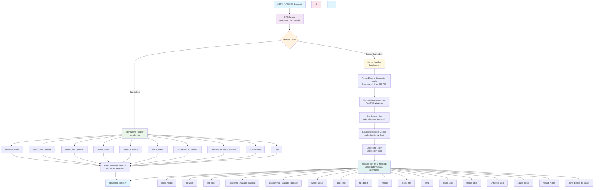

# Neptune-CLI RPC Server Flow Diagram

## Complete RPC Flow Architecture

## Flow Description

### 1. **HTTP JSON-RPC Request**

- Client sends HTTP POST request to neptune-cli RPC server
- Request includes method name, parameters, and authentication cookie

### 2. **RPC Server Routing**

- neptune-cli RPC server receives request
- Routes to appropriate handler based on method type

### 3. **Standalone Methods** (No neptune-core required)

- **Wallet Operations**: generate_wallet, export_seed_phrase, import_seed_phrase
- **Address Generation**: nth_receiving_address, premine_receiving_address
- **Shamir Secret Sharing**: shamir_share, shamir_combine
- **Utility**: which_wallet, completions, help
- These methods work directly with wallet files and don't need neptune-core

### 4. **Server-Dependent Methods** (Require neptune-core)

- **Connection**: Reuse existing connection logic from `main.rs` (lines 755-785)
- **Authentication**: Use neptune-core's existing cookie system
  - Load neptune-core's `.cookie` file via `auth::Cookie::try_load()`
  - Convert to `auth::Token` for RPC calls
- **RPC Calls**: Use exact same tarpc pattern as CLI commands

### 5. **neptune-core RPC Methods**

- **Read State**: block_height, network, list_coins, balances, wallet_status
- **Blockchain**: tip_digest, header, block_info, peer_info
- **Transactions**: send, claim_utxo, freeze_utxo, unfreeze_utxo
- **Mining**: pause_miner, restart_miner, mine_blocks_to_wallet

### 6. **Response**

- All methods return JSON-RPC response
- Sent back to client via HTTP

## Key Features

- **Reused Connection Logic**: Server-dependent methods copy the exact connection pattern from `main.rs`
- **Method Separation**: Clear distinction between standalone and server-dependent methods
- **Proven Authentication**: Uses neptune-core's existing cookie system (`auth::Cookie::try_load()`)
- **Consistent Interface**: All methods use the same JSON-RPC interface
- **No New Code**: Simply copy existing, working tarpc connection logic
